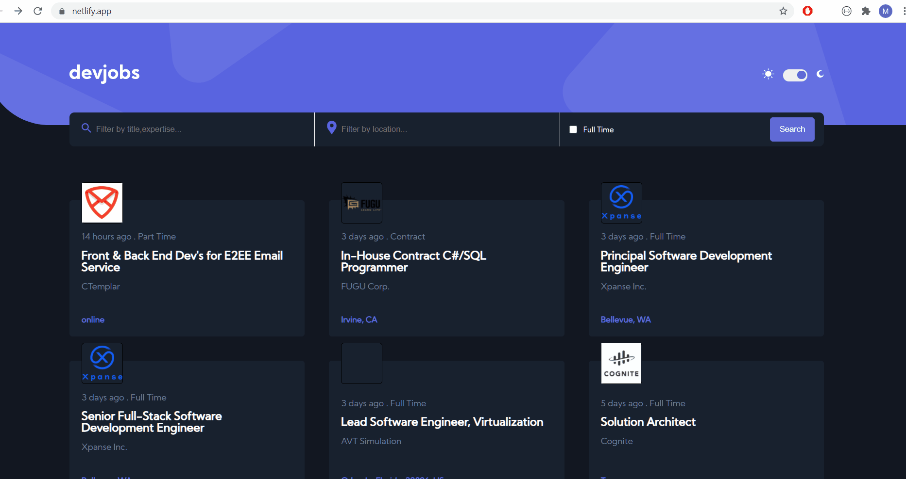
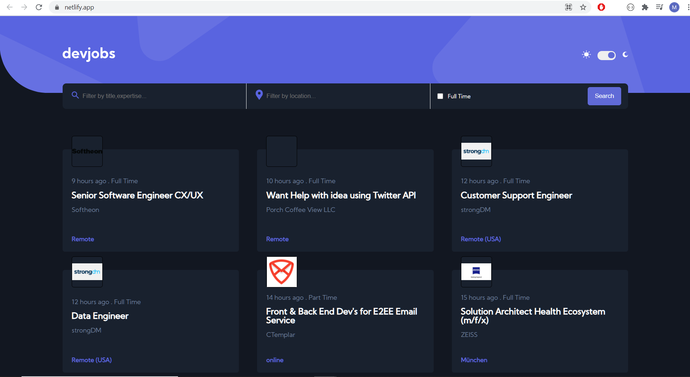
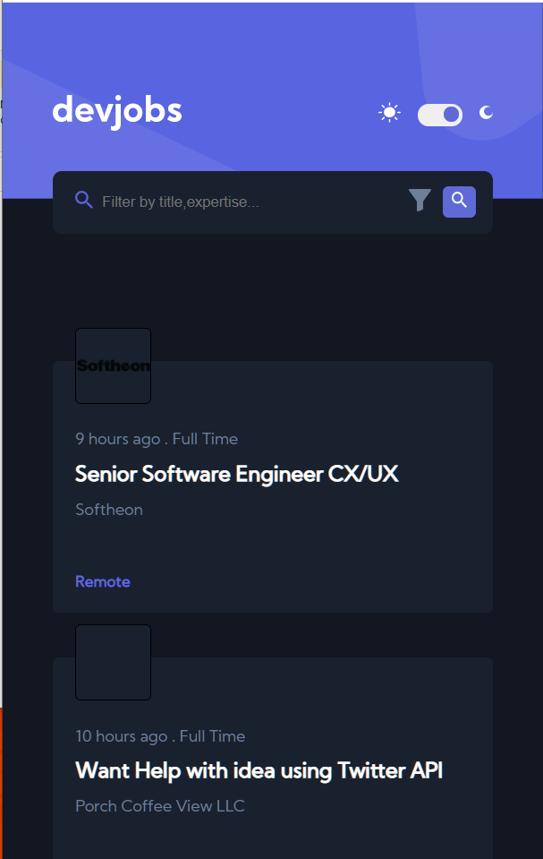
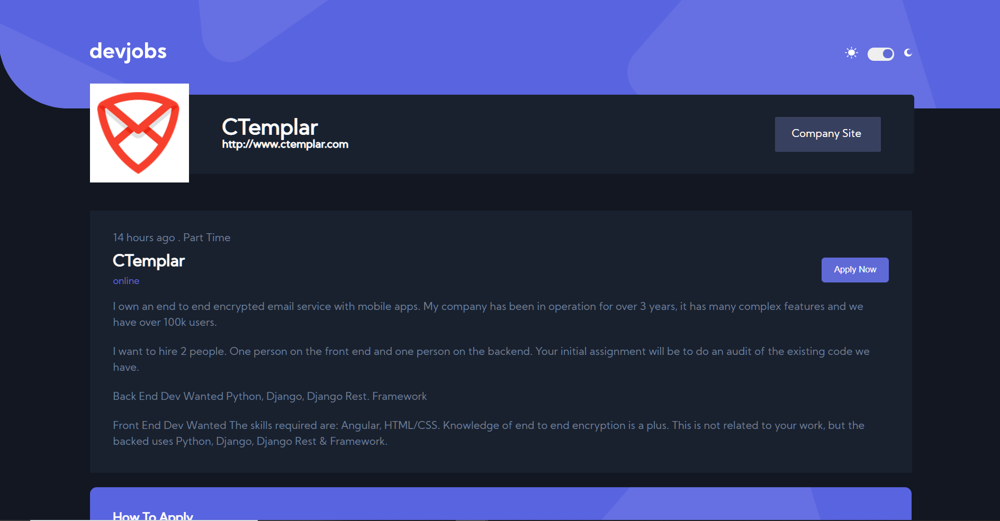

# GITHUB JOBS API PROJECT
  

This Project was inspired by the design at FrontEnd Mentors https://www.frontendmentor.io/challenges/github-jobs-api-93L-NL6rP
 The user can search jobs based on location and job type and will be redirected to an other page where he can view further description obout the job
 The user can also pick between a light theme and a dark theme

## Tech Stack used:

<code></code>
<code></code>
<code></code>
<code></code>
<code></code>

## Sneak peek

## <code>Landing Page</code>

## <code>Responsive</code>

## <code>View Job Page</code>

### Installation and Setup Instructions

Clone down this repository. You will need node and npm installed globally on your machine. Installation: npm install To Run Test Suite: npm test To Start Server: npm start To Visit App: localhost:3000/

## Tech Library used:
  <ul>
    <li>React APP</li>
    <li>Axios</li>
    <li>react</li>
    <li>react-dom</li>
    <li>react-modal</li>
    <li>react-redux</li>
    <li>react-router-dom</li>
    <li>styled-components</li>
    <li>@material-ui/core/li>
    <li>antd/li>
  </ul>
  
  ### Link
  <a href="https://6022192b6119535862d39f8c--friendly-kilby-a210cb.netlify.app/#/1a3e40c4-e1d1-43a3-a814-c788287e040e">https://6022192b6119535862d39f8c--friendly-kilby-a210cb.netlify.app/#/1a3e40c4-e1d1-43a3-a814-c788287e040e</a>
